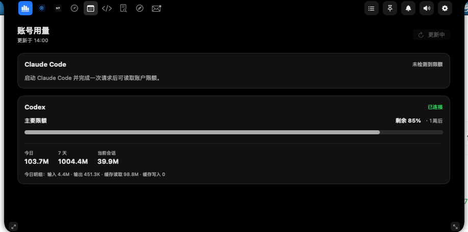
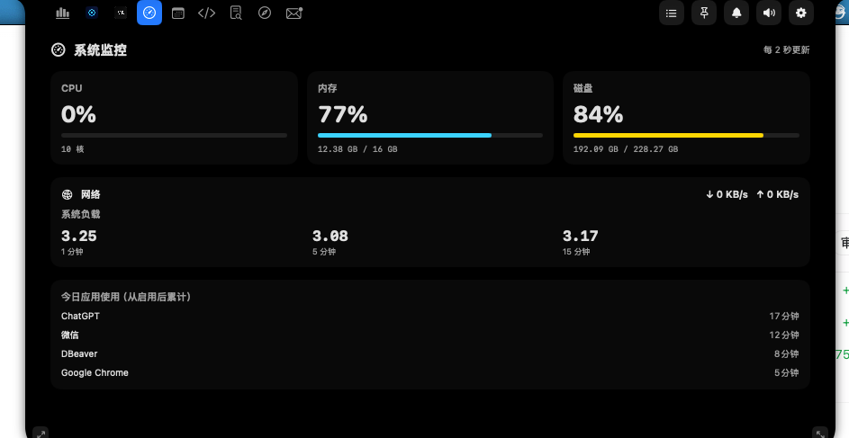
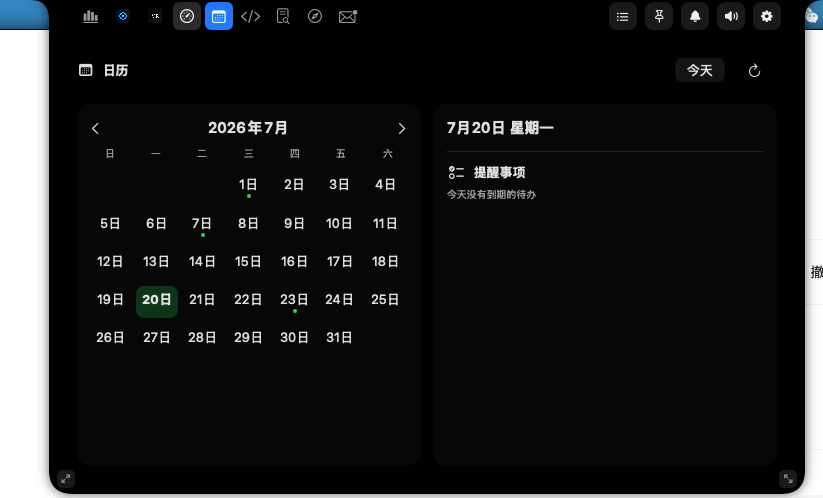
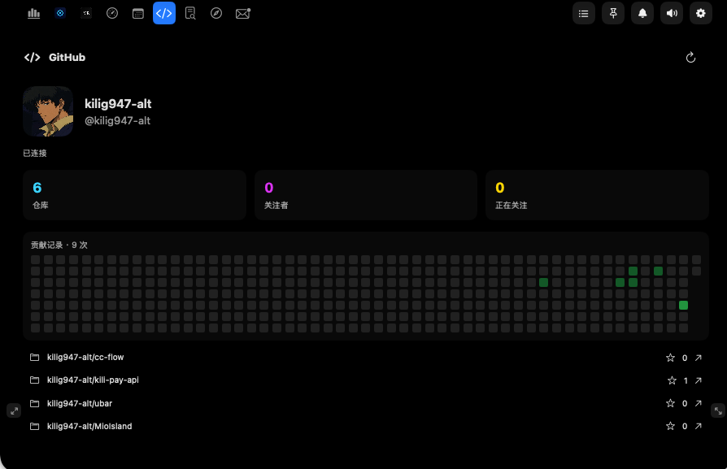
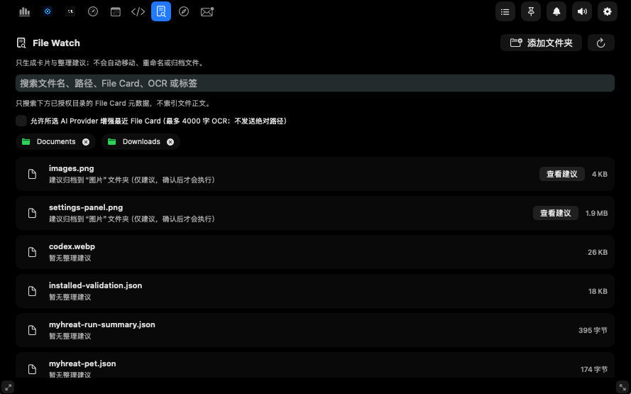
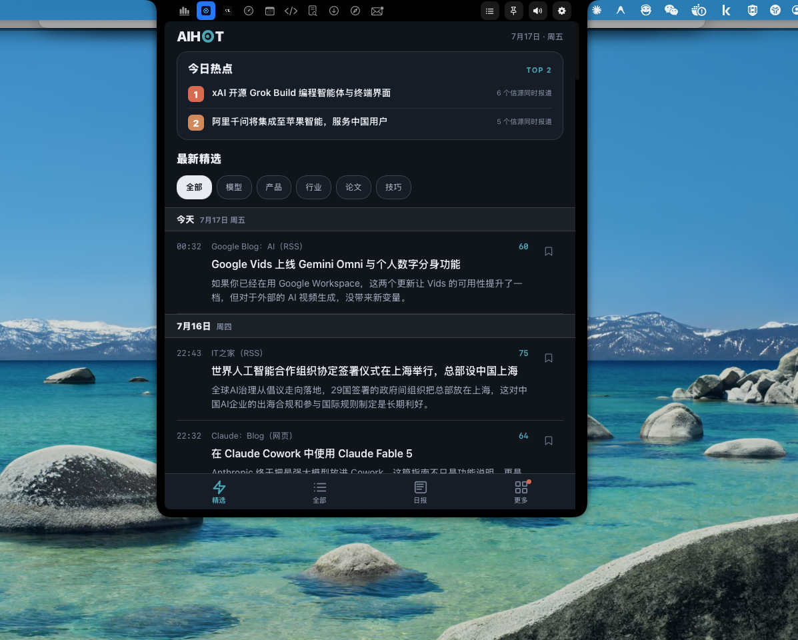

<h1 align="center">
  CC FLOW
</h1>
<p align="center">
  <b>简体中文</b> · <a href="README.en.md">English</a>
</p>
<p align="center">
  <b>macOS 菜单栏里的 Claude Code、Codex 与 TRAE 会话中枢</b><br>
  <a href="#安装">安装</a> •
  <a href="#功能">功能</a> •
  <a href="#生产力功能">生产力</a> •
  <a href="#从源码构建">构建</a> •
  <a href="docs/privacy-policy.md">隐私政策</a>
</p>

<p align="center">
  
  
  
  
</p>

<p align="center">
  <sub>监视活跃的 AI 编码会话，响应审批请求，并从原生 macOS Flow Island 一键跳回对应终端、tmux pane 或 IDE。</sub>
</p>

<p align="center">
  
</p>

## 什么是 CC FLOW？

CC FLOW 是一款 macOS 菜单栏应用。当 Claude Code、Codex 或 TRAE 会话需要关注时，它会展开为紧凑的灵动岛风格面板。应用通过各客户端的正式 Hook 接口接收审批、提问、工具执行、压缩、子代理和生命周期事件。

除了会话监控，CC FLOW 还提供可独立启用、排序和选择的生产力功能、音乐控制、文件中转站，并支持在 Flow Island 中嵌入自定义 HTML 页面或远程网页。

Claude Code 与 Codex 是默认集成；TRAE、TRAE CN、TRAE WORK 和 TRAE WORK CN 在检测到对应应用或既有 Hook 安装后展示。CC FLOW 使用全新的应用身份和运行目录，不读取旧 TRAE FLOW 设置或用户资产。

## 功能

- **三类客户端** — Claude Code、Codex 默认启用，兼容四个 TRAE 变体。
- **Flow Island 左右分区** — 左侧展示内置功能或会话内容，右侧聚合 Claude、Codex、TRAE 待处理数；TRAE 可展开到四个变体。
- **自定义组件** — Flow Island 左侧可组合音乐、中转站、AI HOT、Mineradio、本地 HTML 和远程网页，支持排序、开关和展开尺寸记忆。
- **生产力工作台** — File Watch、下载监控、浏览器资源、邮件助手、日历、GitHub 和 AI HOT 均可独立启用、排序与选择。
- **主动通知** — 新下载开始/完成、浏览器新资源和本地邮件信号可主动展开对应功能；到期提醒事项每 30 分钟重复提醒，直至完成。
- **🎵 音乐控制** — 内置「正在播放」面板，支持 Music.app、Spotify、网易云音乐、QQ 音乐。紧凑态显示封面和曲目信息，展开态提供完整播放控制。
- **📦 中转站** — 文件暂存区，支持拖入文件暂存，展开态显示文件网格，可通过 AirDrop 一键分享全部文件。
- **🤖 AI HOT 与 ⛏ Mineradio** — 聚合 AI 行业动态，或在岛内播放音乐并显示歌词；收起后通过离屏 WebView 保持运行。
- **📄 自定义区域与网页嵌入** — 渲染本地 HTML 或远程网页，支持 JS Bridge 提示、自定义名称、URL 和图标。
- **正式 Hook profiles** — 管理 `~/.claude/settings.json`、`~/.codex/hooks.json` 与检测到的 TRAE Hook 配置，同时保留用户自己的 Hook。
- **一键跳回** — Claude/Codex 优先返回捕获到的终端、tmux pane 或 IDE；Codex 有 deep link 时优先使用；TRAE 保留逐变体跳回。
- **关注优先 UI** — 在会话需要审批、输入、审查或干预之前保持紧凑状态。
- **从灵动岛操作** — 无需切换标签页即可审批工具、拒绝请求和回复追问。
- **🐱 内置宠物** — 支持精灵表动画、拖拽分离、滚轮缩放和动画速度调节，兼容 Codex 宠物规范。

<a id="支持的变体"></a>

## 支持的客户端

| 客户端 | 默认展示 | Hook 配置 | 岛内响应 |
| --- | --- | --- | --- |
| Claude Code | 是 | `~/.claude/settings.json` | 审批与 AskUserQuestion |
| Codex | 是 | `~/.codex/hooks.json`（首次安装后需在 Codex `/hooks` 中信任） | PermissionRequest 审批；通用提问跳回终端 |
| TRAE 系列 | 检测后展示 | 见下表 | 官方 Hook 支持的审批与提问 |

TRAE 兼容变体：

| 变体           | Bundle ID           | URL Scheme   | 官方 Hook                 | Profile ID     |
| ------------ | ------------------- | ------------ | ----------------------- | -------------- |
| TRAE         | `com.trae.app`      | `trae://`    | `~/.trae/hooks.json`    | `trae`         |
| TRAE CN      | `cn.trae.app`       | `trae-cn://` | `~/.trae-cn/hooks.json` | `trae-cn`      |
| TRAE WORK    | `com.trae.solo.app` | `solo://`    | 暂未支持                    | `trae-work`    |
| TRAE WORK CN | `cn.trae.solo.app`  | `solo-cn://` | 暂未支持                    | `trae-work-cn` |

TRAE 和 TRAE CN 支持官方 Hook。TRAE WORK 和 TRAE WORK CN 当前客户端版本尚未提供官方 Hook，因此设置中明确显示不可用。

TRAE 变体由 Hook profile 参数与捕获到的 bundle identifier 统一解析。

## Flow Island 布局

### 紧凑态


<p align="center">
  
</p>

紧凑态可以在左侧显示 Codex 剩余额度，并在右侧同步呈现待处理任务数。

- **左侧**：当前选中的功能视图（音乐 / 中转站 / AI HOT / Mineradio / 自定义区域 / 网页），正在播放音乐时自动切换到音乐。
- **右侧**：CC 图标与全部客户端待处理总数。

### 展开态


- **顶部**：功能切换栏，支持独立启用、选择与拖拽排序。
- **左侧**：当前功能的展开内容，或活跃会话详情（审批、追问、完成）。
- **右侧**：Claude、Codex、TRAE 顶层计数；TRAE 展开后显示四个变体及跳回按钮。

## 内置功能

### 🎵 音乐

系统「正在播放」面板，无需离开编码环境即可查看和控制音乐播放。

- **支持播放器**：Music.app、Spotify、网易云音乐、QQ 音乐
- **技术实现**：通过 MediaRemote 私有框架（dlopen 动态加载）获取系统级播放信息，AppleScript 作为备用方案
- **紧凑态**：18pt 圆角封面缩略图 + 截断曲目标题，无播放时显示灰色音符图标
- **展开态**：140pt 封面大图 + 曲目/艺术家/专辑信息 + 可拖拽进度条 + 完整播放控制（上一曲 / 播放暂停 / 下一曲），背景为封面主色调动态渐变

### 📦 中转站

轻量级文件暂存区，方便在不同应用间快速传递文件。

- **添加文件**：从任意位置拖入文件
- **分享文件**：通过 AirDrop 一键分享暂存的所有文件
- **管理文件**：展开态以 4 列网格展示图标和文件名，右键可移除单个文件
- **注意**：中转站文件仅在内存中暂存，退出应用后自动清空

### 📄 自定义区域

在灵动岛中渲染本地 HTML 目录和外部网站URL，支持完整的 Web 交互能力。


- **JS Bridge**：HTML 页面可调用 `window.webkit.messageHandlers.ccFlowHint.postMessage()` 向紧凑态推送限时通知
- **文件监听**：通过 FSEvents 监听文件变化，自动刷新 Flow Island 和设置预览
- **安全沙箱**：WebView 默认限制外部网络访问和 JavaScript 窗口创建；可配置允许网络访问和 `fetch` 请求
- **书签持久化**：沙箱外目录通过 Security-Scoped Bookmark 持久化访问权限

### 🌐 网页嵌入

在灵动岛中直接加载远程网页，支持编辑名称、URL 和图标，可在系统默认浏览器中打开当前页面，并可选择收起灵动岛后保持网页后台运行。

### 🤖 AI HOT

内置 [AI HOT](https://aihot.virxact.com/) 作为 AI 行业动态聚合入口，支持自定义实例地址并自动获取站点图标。

### ⛏ Mineradio

内置 Mineradio Bridge 兼容层，在灵动岛内直接播放 [Mineradio](https://mineradio.art/) 音乐并展示歌词。

- **平台支持**：网易云音乐、QQ 音乐、酷狗音乐
- **歌词显示**：紧凑态可展示当前歌词，展开态浏览完整播放器
- **后台播放**：收起灵动岛后仍通过离屏窗口保持 WebView 运行，音乐不间断
- **登录同步**：登录状态通过默认 Cookie 存储共享，支持在设置中查看/登出

## 生产力功能

生产力功能位于 Flow Island 左侧功能栏，可在设置中逐项启用、停用、排序，并分别选择紧凑态与展开态内容。

### 生产力功能预览

<table>
  <tr>
    <td width="50%" align="center"><strong>账号用量</strong><br></td>
    <td width="50%" align="center"><strong>系统监控</strong><br></td>
  </tr>
  <tr>
    <td width="50%" align="center"><strong>日历与提醒事项</strong><br></td>
    <td width="50%" align="center"><strong>GitHub</strong><br></td>
  </tr>
  <tr>
    <td colspan="2" align="center"><strong>File Watch</strong><br></td>
  </tr>
</table>

### 🔎 File Watch

File Watch 合并了 File Card 与自然搜索，只处理用户明确授权的目录。

- 默认建议授权 `Downloads` 和 `Documents`，也可添加任意自定义文件夹。
- 搜索范围仅包括文件名、路径、File Card、OCR 与标签，不索引文档正文。
- File Card 可使用所选 AI Provider 增强，但最多发送 4000 字 OCR，且不发送绝对路径。
- 只生成卡片与整理建议；移动、重命名或归档必须由用户确认后执行，并支持撤销。

### ⬇️ 下载监控与 🌐 浏览器资源

- 支持 Chrome、Microsoft Edge 与 Safari 扩展；设置页与未连接功能页提供一键连接入口。
- 点击连接会复制本地配对令牌、收起 Flow Island，并打开对应浏览器或扩展设置指引。
- 扩展通过本机 `127.0.0.1` 端点配对，并用心跳显示真实连接状态。
- 下载监控在“新下载开始”和“下载完成”时主动通知；浏览器资源只保存用户主动提交的网页，不修改浏览器书签。
- Safari 只提供网页资源保存；下载完成记录可由已授权的 `Downloads` 目录补充。

构建本地浏览器扩展：

```bash
./scripts/build-browser-extensions.sh
```

Chrome 与 Edge 可分别加载 `BrowserExtensions/dist/Chrome`、`BrowserExtensions/dist/Edge`。Safari 容器可通过 `./scripts/build-safari-extension.sh` 生成。

### ✉️ 邮件助手

通过 macOS「邮件」App 的本地数据与通知提取最近邮件的发件人、主题和验证码。它不会保存正文，也不会修改邮件已读状态；新邮件信号可主动展开邮件助手。

### 📅 日历与提醒事项

- 左侧显示月历，右侧聚合节日、日程和提醒事项。
- Todo 范围仅包含已到期和今天到期的未完成提醒事项。
- 未完成项目每 30 分钟主动提醒一次；勾选后会把 macOS「提醒事项」中的对应项目标记为已完成。

### 🐙 GitHub

- 优先读取本机 `gh auth login` 登录状态，也支持 Personal Access Token 备用登录。
- 显示个人资料、贡献热力图与仓库列表；热力图自适应面板宽度，仓库行可直接打开 GitHub 地址。

### 权限与数据边界

设置中的“生产力连接”和“权限与数据来源”会展示 GitHub、AI Provider、浏览器扩展、日历、提醒事项、文件夹与 Mail Automation 的实际状态。配对令牌与 API 密钥保存于本机 macOS 钥匙串；未经授权的目录不会被 File Watch 搜索。

### 🐱 内置宠物

基于精灵表（spritesheet）动画的桌面宠物系统，兼容 Codex 宠物规范。宠物会在 Flow Island 中展示不同状态的动画（空闲、运行、等待、跳跃等），陪伴编码过程。


支持将宠物拖拽到桌面显示，鼠标滚轮可调整宠物显示大小。

#### 内置宠物主题包

| 宠物             | ID           | 类型 |
| -------------- | ------------ | -- |
| **CC FLOW**  | `ccflow`     | 默认 |
| **月薪喵**        | `yuexinmiao` | 动物 |
| **光环小猫**       | `halokitten` | 动物 |
| **鸡哥 ikun**    | `ikun`       | 动物 |
| **Frieren**    | `frieren`    | 人物 |
| **Homelander** | `homelander` | 未知 |
| **Shinchan**   | `shinchan`   | 未知 |
| **TaoTao**     | `taotao`     | 人物 |

宠物主题包遵循 Codex 规范的 8 列 × 9 行精灵表格式（1536×1872，每帧 192×208），支持从 `~/.cc-flow/pets/` 或 `~/.codex/pets/` 加载。

<br />

## 安装

### 下载发布版本

1. 前往 [Releases](https://github.com/kilig947-alt/cc-flow/releases)。
2. 下载最新的 DMG。
3. 将 `CC FLOW.app` 拖到应用程序文件夹。
4. 启动应用并选择需要启用的 Hook profiles。

> 首次启动时，macOS 可能要求确认应用或授予辅助功能 / Apple Events 权限以使用焦点和跳转功能。

> ⚠️ **未公证版本安装提示**
>
> 当前 GitHub Release 构建使用 ad-hoc 签名，**未经过 Apple 公证（Notarization）**。首次打开时，macOS Gatekeeper 可能会拦截并提示“无法打开，因为无法验证开发者”。
>
> 解决方法（任选其一）：
>
> - 在“系统设置” > “隐私与安全性”中，找到“已阻止使用 CC FLOW”提示，点击“仍要打开”。
>   
> - 右键点击应用图标，选择“打开”。
> - 在终端执行：
>   ```bash
>   xattr -d com.apple.quarantine /Applications/CC\ FLOW.app
>   ```

### 从源码构建

需要 macOS 14+ 和可构建 Xcode 项目及 Swift 6.1 `Prototype` 包测试的 Xcode 工具链。

```bash
git clone https://github.com/kilig947-alt/cc-flow.git
cd cc-flow

# Debug 构建
xcodebuild -project CCFlow.xcodeproj -scheme CCFlow \
  -configuration Debug CODE_SIGNING_ALLOWED=NO build

# Release 构建
xcodebuild -project CCFlow.xcodeproj -scheme CCFlow \
  -configuration Release CODE_SIGNING_ALLOWED=NO build
```

创建本地可分享的未签名测试包：

```bash
./scripts/package-unsigned.sh
```

## 工作原理

```text
Claude Code / Codex / TRAE variants
  -> Official Hook profiles
    -> CCFlowBridge (--source <claude|codex|trae>)
      -> Unix socket (/tmp/cc-flow.sock)
        -> HookSocketServer (provider + client profile routing)
          -> SessionStore
            -> SessionMonitor / NotchViewModel
              -> Flow Island (左: 功能视图 / 会话详情, 右: 变体计数 / 跳回)
```

实现要点：

- Bridge 为 session ID 加 provider namespace，避免不同客户端相同 ID 相互覆盖。
- Socket 默认 `/tmp/cc-flow.sock`；配置位于 `~/Library/Application Support/cc-flow/bridge-config.json`。
- 环境变量读取顺序为 `CC_FLOW_*`、`TRAE_FLOW_*`、`ISLAND_*`。
- Bridge launcher 位于 `~/.cc-flow/bin/cc-flow-bridge`，安装时会清理旧 TRAE FLOW 托管条目，但保留用户 Hook。
- Codex 命令 Hooks 由 Codex 自身维护信任状态；CC FLOW 安装后会显示信任指引，收到真实 Codex Hook 事件后才标记为已生效。

## 系统要求

- macOS 14.0 或更高
- 带刘海的 MacBook 体验最佳，但也支持外接显示器
- 安装 Claude Code、Codex 或任一 TRAE 变体

<br />

## 测试

```bash
# 全仓库回归测试
./scripts/test.sh

# 仅 Prototype 测试
swift test --package-path Prototype

# Xcode 单元测试
xcodebuild -project CCFlow.xcodeproj -scheme CCFlow -configuration Debug CODE_SIGNING_ALLOWED=NO test -only-testing:CCFlowTests
```

## 致谢

CC FLOW 基于 [ccsonicc333/trae-flow](https://github.com/ccsonicc333/trae-flow.git) 继续开发，感谢原维护者及贡献者奠定的项目基础。

CC FLOW 延续了 [ping-island](https://github.com/erha19/ping-island)、[vibe-notch](https://github.com/farouqaldori/vibe-notch)、[boring.notch](https://github.com/TheBoredTeam/boring.notch) 和 [claude-island](https://github.com/farouqaldori/claude-island) 等项目的灵动岛会话监视理念。

## 许可证

Apache 2.0 — 详见 [LICENSE.md](LICENSE.md)。
